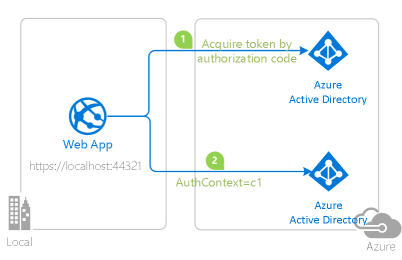
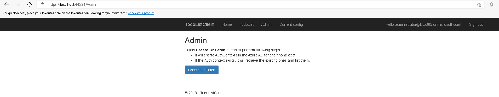
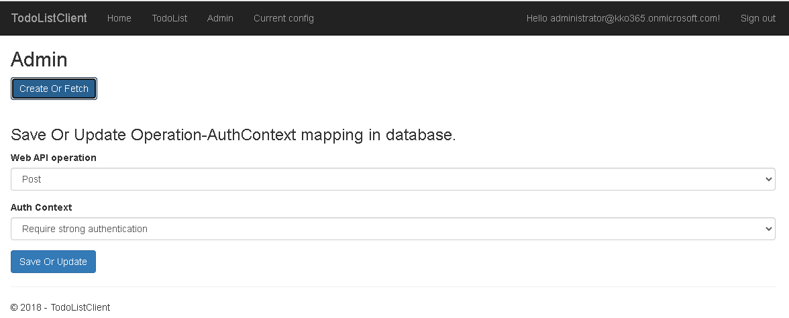
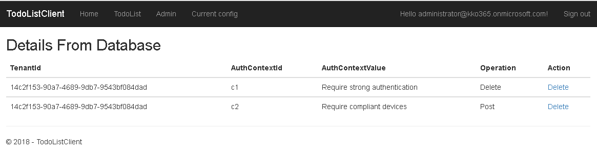
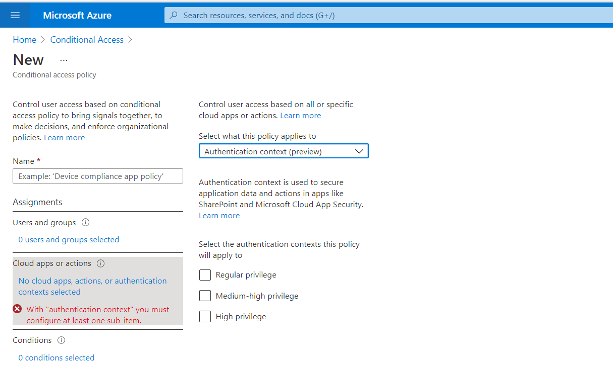
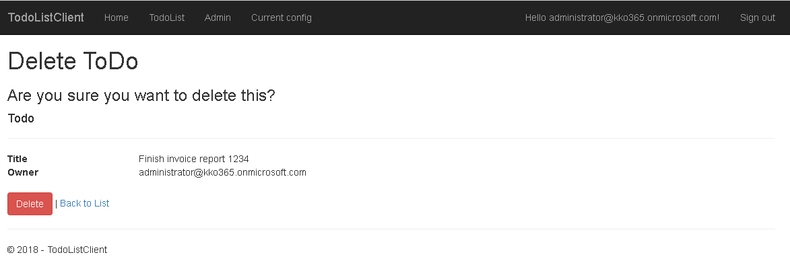

# Use the Conditional Access auth context to perform step-up authentication for high-privilege operations in a Web app

 1. [Overview](#overview)
 1. [Scenario](#scenario)
 1. [Contents](#contents)
 1. [Prerequisites](#prerequisites)
 1. [Setup](#setup)
 1. [Registration](#registration)
 1. [Running the sample](#running-the-sample)
 1. [Explore the sample](#explore-the-sample)
 1. [About the code](#about-the-code)
 1. [Deployment](#deployment)
 1. [More information](#more-information)
 1. [Community Help and Support](#community-help-and-support)
 1. [Contributing](#contributing)

## Overview

This code sample uses the Conditional Access Auth Context to demand a higher bar of authentication for certain high-privileged and sensitive operations in a Web App.

> To use the CA Auth context in a Web API, please try the [Use the Conditional Access auth context to perform step-up authentication for high-privilege operations in a Web API](https://github.com/Azure-Samples/ms-identity-ca-auth-context/blob/main/README.md) code sample
 
## Scenario

1. The client ASP.NET Core Web App uses the [Microsoft.Identity.Web](https://aka.ms/microsoft-identity-web) and Microsoft Authentication Library for .NET ([MSAL.NET](https://aka.ms/msal-net)) to sign-in a user with **Azure AD**.
1. For sensitive operations, the Web app can be configured to demand step-up authentication, like MFA, from the signed-in user



> :information_source: Check out the recorded session on this topic: [Use Conditional Access Auth Context in your app for step-up authentication](https://www.youtube.com/watch?v=_iO7CfoktTY&ab_channel=Microsoft365Community)
> 
## Prerequisites

- [Visual Studio](https://visualstudio.microsoft.com/downloads/)
- An **Azure AD** tenant. For more information see: [How to get an Azure AD tenant](https://docs.microsoft.com/azure/active-directory/develop/quickstart-create-new-tenant)
- A user account in your **Azure AD** tenant. This sample will not work with a **personal Microsoft account**. Therefore, if you signed in to the [Azure portal](https://portal.azure.com) with a personal account and have never created a user account in your directory before, you need to do that now.
- [Azure AD premium P1](https://azure.microsoft.com/pricing/details/active-directory/) is required to work with Conditional Access policies.

## Setup

### Step 1: Clone or download this repository

From your shell or command line:

```console
    git clone https://github.com/Azure-Samples/ms-identity-dotnetcore-ca-auth-context-app.git
```

or download and extract the repository .zip file.

> :warning: To avoid path length limitations on Windows, we recommend cloning into a directory near the root of your drive.

There is one project in this sample. To register it, you can:

- follow the steps below for manually register your apps
- or use PowerShell

### Step 2 (Setup with PowerShell script): Register the sample application(s) with your Azure Active Directory tenant:

- **automatically** creates the Azure AD applications and related objects (passwords, permissions, dependencies) for you.
- modify the projects' configuration files.

 <details>
   <summary>Expand this section if you want to use this automation:</summary>

  > :warning: If you have never used **Azure AD Powershell** before, we recommend you go through the [App Creation Scripts](./AppCreationScripts/AppCreationScripts.md) once to ensure that your environment is prepared correctly for this step.

1. On Windows, run PowerShell as **Administrator** and navigate to the root of the cloned directory
1. If you have never used Azure AD Powershell before, we recommend you go through the [App Creation Scripts](./AppCreationScripts/AppCreationScripts.md) once to ensure that your environment is prepared correctly for this step.
1. In PowerShell run:

   ```PowerShell
   Set-ExecutionPolicy -ExecutionPolicy RemoteSigned -Scope Process -Force
   ```

1. Run the script to create your Azure AD application and configure the code of the sample application accordingly.
1. In PowerShell run:

   ```PowerShell
   cd .\AppCreationScripts\
   .\Configure.ps1
   ```

   > Other ways of running the scripts are described in [App Creation Scripts](./AppCreationScripts/AppCreationScripts.md)
   > The scripts also provide a guide to automated application registration, configuration and removal which can help in your CI/CD scenarios.

 </details>

### Step 2 (Alternative Manual setup): Choose the Azure AD tenant where you want to create your applications

As a first step you'll need to:

1. Sign in to the [Azure portal](https://portal.azure.com).
1. If your account is present in more than one Azure AD tenant, select your profile at the top right corner in the menu on top of the page, and then **switch directory** to change your portal session to the desired Azure AD tenant.

#### Register the client app (TodoListClient-authContext-webapp)

1. Navigate to the [Azure portal](https://portal.azure.com) and select the **Azure AD** service.
1. Select the **App Registrations** blade on the left, then select **New registration**.
1. In the **Register an application page** that appears, enter your application's registration information:
   - In the **Name** section, enter a meaningful application name that will be displayed to users of the app, for example `TodoListClient-authContext-webapp`.
   - Under **Supported account types**, select **Accounts in this organizational directory only**.
   - In the **Redirect URI (optional)** section, select **Web** in the combo-box and enter the following redirect URI: `https://localhost:44321/`.
     > Note that there are more than one redirect URIs used in this sample. You'll need to add them from the **Authentication** tab later after the app has been created successfully.
1. Select **Register** to create the application.
1. In the app's registration screen, find and note the **Application (client) ID**. You use this value in your app's configuration file(s) later in your code.
1. In the app's registration screen, select **Authentication** in the menu.
   - If you don't have a platform added, select **Add a platform** and select the **Web** option.
   - In the **Redirect URIs** section, enter the following redirect URIs.
      - `https://localhost:44321/signin-oidc`
   - In the **Front-channel logout URL** section, set it to `https://localhost:44321/signout-oidc`.
1. Select **Save** to save your changes.
1. In the app's registration screen, select the **Certificates & secrets** blade in the left to open the page where we can generate secrets and upload certificates.
1. In the **Client secrets** section, select **New client secret**:
   - Type a key description (for instance `app secret`),
   - Select one of the available key durations (**In 1 year**, **In 2 years**, or **Never Expires**) as per your security posture.
   - The generated key value will be displayed when you select the **Add** button. Copy the generated value for use in the steps later.
   - You'll need this key later in your code's configuration files. This key value will not be displayed again, and is not retrievable by any other means, so make sure to note it from the Azure portal before navigating to any other screen or blade.
1. In the app's registration screen, select the **API permissions** blade in the left to open the page where we add access to the APIs that your application needs.
   - Select the **Add a permission** button and then,
   - Ensure that the **Microsoft APIs** tab is selected.
   - In the *Commonly used Microsoft APIs* section, select **Microsoft Graph**
   - In the **Delegated permissions** section, select the **User.Read**, **Policy.Read.ConditionalAccess**, **Policy.ReadWrite.ConditionalAccess** in the list. Use the search box if necessary.
   - `Note: The Graph permission, **Policy.ReadWrite.ConditionalAccess** is required for creating new auth context records by this sample. In production, the permission, **Policy.Read.ConditionalAccess** should be sufficient to read existing values and thus is recommended.`
   - Select the **Add permissions** button at the bottom.
   - It is advisable to grant admin consent for these permissions here on this screen.

#### Configure the client app (TodoListClient-authContext-webapp) to use your app registration

Open the project in your IDE (like Visual Studio or Visual Studio Code) to configure the code.

> In the steps below, "ClientID" is the same as "Application ID" or "AppId".

1. Open the `TodoListClient\appsettings.json` file.
1. Find the key `Domain` and replace the existing value with your Azure AD tenant name.
1. Find the key `TenantId` and replace the existing value with your Azure AD tenant ID.
1. Find the key `ClientId` and replace the existing value with the application ID (clientId) of `TodoListClient-authContext-webapp` app copied from the Azure portal.
1. Find the key `ClientSecret` and replace the existing value with the key you saved during the creation of `TodoListClient-authContext-webapp` copied from the Azure portal.

## Running the sample

> For Visual Studio Users
>
> Clean the solution, rebuild the solution, and run it.  You might want to go into the solution properties and set both projects as startup projects, with the service project starting first.

```console
    cd TodoListClient
    dotnet run
```

## Explore the sample

### Configure the Auth context

1. We'd first replicate the experience of an admin configuring the auth contexts. For that, browse to `https://localhost:44321` and sign-in using a tenant Admin account. Click on the **Admin** link on the menu.

    
2. As a first step, you will ensure that a set of Auth Context is already available in this tenant. Click the **CreateOrFetch** button to check if they exist. If they don't , the code will create three sample auth context entries for you. These three entires are named `Require strong authentication`, `Require compliant devices` and `Require trusted locations`.

    > Note: The Graph permission, **Policy.ReadWrite.ConditionalAccess** is required for creating new auth context records. In production, the permission, **Policy.Read.ConditionalAccess** should be sufficient to read existing values and is thus the only one recommended.

    

    Select an operation in the Todo list controller and map it with an `Authentication Context` value. To apply click **SaveOrUpdate**. This updates this mapping in the local app's database.

>Note: When changing auth context mappings, have the user sign-out and sign-back in for the changes to take effect.

3. Go to **Current config** link to get details of data saved on the Web API side in its database. You can  **Delete** if you need to delete a mapping from the local database.

    

The web app is now ready to challenge users for step-up auth for the selected operations.

### Configure a Conditional Access policy to use auth context in Azure portal

1. Navigate to Azure Active Directory> Security > Conditional Access
1. Select **New policy** and go to **Cloud apps or actions**. In dropdown select **Authentication context**. The newly created auth context values will be listed for you to be used in this CA policy.

    

    Select the value and create the policy as required. For example, you might want the user to satisfy a MFA challenge if the auth context value is 'Medium'.

### Test in the Web App

1. Browse `https://localhost:44321` and sign-in.
1. Select `TodoList` page and perform the operations.

    

If an operation was saved for a certain authContext and there is a CA policy configured and enabled, the user  will be redirected to Azure AD and ask to perform the required step(s) like MFA.

> :information_source: Did the sample not work for you as expected? Then please reach out to us using the [GitHub Issues](../../issues) page.

## About the code

### Code for the Web app (TodoListClient)

1. In `Startup.cs`, the following lines of code enables Microsoft identity platform endpoint to sign-in users.

    ```csharp
    services.AddAuthentication(OpenIdConnectDefaults.AuthenticationScheme)
            .AddMicrosoftIdentityWebApp(Configuration, "AzureAd", subscribeToOpenIdConnectMiddlewareDiagnosticsEvents: true)
    ```

    Additionally, the following lines of code this app to call MS Graph.

    ```csharp

                 .EnableTokenAcquisitionToCallDownstreamApi()
                     .AddMicrosoftGraph(Configuration.GetSection("GraphBeta"))
                 .AddInMemoryTokenCaches();
    ```

1. In `AdminController.cs`, the method **GetAuthenticationContextValues** returns a default set of AuthN context values for the app to work with, either from Graph or a default hard coded set.

    ```csharp
    private async Task<Dictionary<string, string>> GetAuthenticationContextValues()
    {
         Dictionary<string, string> dictACRValues = new Dictionary<string, string>()
            {
                    {"C1","Require strong authentication" },
                    {"C2","Require compliant devices" },
                    {"C3","Require trusted locations" }
        };

        string sessionKey = "ACRS";

        if (HttpContext.Session.Get<Dictionary<string, string>>(sessionKey) != default)
        {
            dictACRValues = HttpContext.Session.Get<Dictionary<string, string>>(sessionKey);
        }
        else
        {
            var existingAuthContexts = await _authContextClassReferencesOperations.ListAuthenticationContextClassReferencesAsync();

            if (existingAuthContexts.Count() > 0)                 
            {
                dictACRValues.Clear();

                foreach (var authContext in existingAuthContexts)
                {
                    dictACRValues.Add(authContext.Id, authContext.DisplayName);
                }

                HttpContext.Session.Set<Dictionary<string, string>>(sessionKey, dictACRValues);
            }
        }
        return dictACRValues;
    }
    ```

    **CreateOrFetch** method checks if auth context exists then retrieve the list from graph by calling **ListAuthenticationContextClassReferencesAsync** method else call **CreateAuthContextViaGraph** to create the auth context.

    ```csharp
    public async Task<List<Beta.AuthenticationContextClassReference>> CreateOrFetch()
    {
        var lstPolicies = await _authContextClassReferencesOperations.ListAuthenticationContextClassReferencesAsync();
    
        if (lstPolicies?.Count > 0)
        {
            return lstPolicies;
        }
        else
        {
            await CreateAuthContextViaGraph();
        }
        return lstPolicies;
    }
    ```

1. `AuthenticationContextClassReferencesOperations.cs` contains methods that call graph to perform various operations. In current sample we have used create and get methods. **CreateAuthenticationContextClassReferenceAsync** method creates the auth context: `Note: this class calls the /beta endpoint of Graph as the API was available only on the /beta endpoint at the time of this sample's publishing`

    ```csharp
   public async Task<Beta.AuthenticationContextClassReference> CreateAuthenticationContextClassReferenceAsync(string id, string displayName, string description, bool IsAvailable)
    {
        Beta.AuthenticationContextClassReference newACRObject = null;
    
        try
        {
            newACRObject = await _graphServiceClient.Identity.ConditionalAccess.AuthenticationContextClassReferences.Request().AddAsync(new Beta.AuthenticationContextClassReference
            {
                Id = id,
                DisplayName = displayName,
                Description = description,
                IsAvailable = IsAvailable,
                ODataType = null
            });
        }
        catch (ServiceException e)
        {
            Console.WriteLine("We could not add a new ACR: " + e.Error.Message);
            return null;
        }
    
        return newACRObject;
    }
    ```

    **ListAuthenticationContextClassReferencesAsync** method get the existing auth context values from graph.

    ```csharp
    public async Task<List<Beta.AuthenticationContextClassReference>> ListAuthenticationContextClassReferencesAsync()
    {
        List<Beta.AuthenticationContextClassReference> allAuthenticationContextClassReferences = new List<Beta.AuthenticationContextClassReference>();
    
        try
        {
            Beta.IConditionalAccessRootAuthenticationContextClassReferencesCollectionPage authenticationContextClassreferences = await _graphServiceClient.Identity.ConditionalAccess.AuthenticationContextClassReferences.Request().GetAsync();
    
            if (authenticationContextClassreferences != null)
            {
                allAuthenticationContextClassReferences = await ProcessIAuthenticationContextClassReferenceRootPoliciesCollectionPage(authenticationContextClassreferences);
            }
        }
        catch (ServiceException e)
        {
            Console.WriteLine($"We could not retrieve the existing ACRs: {e}");
            if (e.InnerException != null)
            {
                var exp = (MicrosoftIdentityWebChallengeUserException)e.InnerException;
                throw exp;
            }
            throw e;
        }
    
        return allAuthenticationContextClassReferences;
    }
    ```

1. In `TodoListController.cs`, the method **CheckForRequiredAuthContext** retrieves the acrsvalues from database for the request method. Then checks if the access token has `acrs` claim with acrsValue. If does not exists then it creates a **claims** payload to be sent back to Azure AD.

    ```csharp
            public string CheckForRequiredAuthContext(string method)
        {
            string claimsChallenge = string.Empty;

            string savedAuthContextId = _commonDBContext.AuthContext.FirstOrDefault(x => x.Operation == method && x.TenantId == _configuration["AzureAD:TenantId"])?.AuthContextId;

            if (!string.IsNullOrEmpty(savedAuthContextId))
            {
                HttpContext context = this.HttpContext;

                string authenticationContextClassReferencesClaim = "acrs";

                if (context == null || context.User == null || context.User.Claims == null || !context.User.Claims.Any())
                {
                    throw new ArgumentNullException("No Usercontext is available to pick claims from");
                }

                Claim acrsClaim = context.User.FindAll(authenticationContextClassReferencesClaim).FirstOrDefault(x => x.Value == savedAuthContextId);

                if (acrsClaim?.Value != savedAuthContextId)
                {
                    claimsChallenge = "{\"id_token\":{\"acrs\":{\"essential\":true,\"value\":\"" + savedAuthContextId + "\"}}}";
                
                }
            }

            return claimsChallenge;
        }
    ```

### Code for the Web App (TodoListClient)

Methods in `TodoListController.cs` challenges the user to re-authenticate if a claims payload is returned by the CheckforRequiredAuthContext():

```csharp
 string claimsChallenge = CheckForRequiredAuthContext("Delete");

if (!string.IsNullOrWhiteSpace(claimsChallenge))
{
    _consentHandler.ChallengeUser(new string[] { "user.read" }, claimsChallenge);
    return new EmptyResult();
}

```

## More information

- [Developers’ guide to Conditional Access authentication context](https://docs.microsoft.com/azure/active-directory/develop/developer-guide-conditional-access-authentication-context)
- [Claims challenges, claims requests, and client capabilities](https://docs.microsoft.com/azure/active-directory/develop/claims-challenge)
- [Microsoft identity platform (Azure Active Directory for developers)](https://docs.microsoft.com/azure/active-directory/develop/)
- [Overview of Microsoft Authentication Library (MSAL)](https://docs.microsoft.com/azure/active-directory/develop/msal-overview)
- [Quickstart: Register an application with the Microsoft identity platform (Preview)](https://docs.microsoft.com/azure/active-directory/develop/quickstart-register-app)
- [Quickstart: Configure a client application to access web APIs (Preview)](https://docs.microsoft.com/azure/active-directory/develop/quickstart-configure-app-access-web-apis)
- [Understanding Azure AD application consent experiences](https://docs.microsoft.com/azure/active-directory/develop/application-consent-experience)
- [Understand user and admin consent](https://docs.microsoft.com/azure/active-directory/develop/howto-convert-app-to-be-multi-tenant#understand-user-and-admin-consent)
- [Application and service principal objects in Azure Active Directory](https://docs.microsoft.com/azure/active-directory/develop/app-objects-and-service-principals)
- [National Clouds](https://docs.microsoft.com/azure/active-directory/develop/authentication-national-cloud#app-registration-endpoints)
- [MSAL code samples](https://docs.microsoft.com/azure/active-directory/develop/sample-v2-code)

For more information about how OAuth 2.0 protocols work in this scenario and other scenarios, see [Authentication Scenarios for Azure AD](https://docs.microsoft.com/azure/active-directory/develop/authentication-flows-app-scenarios).

## Community Help and Support

Use [Stack Overflow](http://stackoverflow.com/questions/tagged/msal) to get support from the community.
Ask your questions on Stack Overflow first and browse existing issues to see if someone has asked your question before.
Make sure that your questions or comments are tagged with [`azure-active-directory` `azure-ad-b2c` `ms-identity` `adal` `msal`].

If you find a bug in the sample, raise the issue on [GitHub Issues](../../issues).

To provide feedback on or suggest features for Azure Active Directory, visit [User Voice page](https://feedback.azure.com/forums/169401-azure-active-directory).

## Contributing

If you'd like to contribute to this sample, see [CONTRIBUTING.MD](/CONTRIBUTING.md).

This project has adopted the [Microsoft Open Source Code of Conduct](https://opensource.microsoft.com/codeofconduct/). For more information, see the [Code of Conduct FAQ](https://opensource.microsoft.com/codeofconduct/faq/) or contact [opencode@microsoft.com](mailto:opencode@microsoft.com) with any additional questions or comments.
